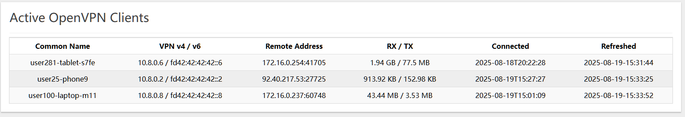

# luci-openvpn-status

Updated by @mrdavidsanders [david at kubology dot uk]
 - Use CBI Tables instead of ```<div/>``` to allow 
   sorting and correct display on mobile devices
 - Update the various filters so this works with 
   OpenWRT `ash`

**OpenVPN Server - Client list on status Page**

This simple and raw page + script will give you in the status page, the list of active OpenVPN Clients
The script will get the status from the openvpn default status on /var/run/openvpn.<instance>.status and post it to a file in /tmp
The html status page will get that information preformatted from the file and display it on the homepage of openwrt.



Alternatively, by adding a script to a remote OpenVPN server, you can display any remote OpenVPN server status.

**Instructions**

1. Go grab the latest version from https://github.com/mrdavidsanders/luci-openvpn-status/releases
2. Extract the files on an OpenWRT/Luci (23+) Router
  ```
  cd extracted_files/
  ./installer.luci.sh
  ```
3. Wait one minute for the client generation script to run and the clients will appear on the home page. 

Authors:
- mrdavidsanders <david at kubology dot uk>
- sebabordon <sebasb@outlook.com>

